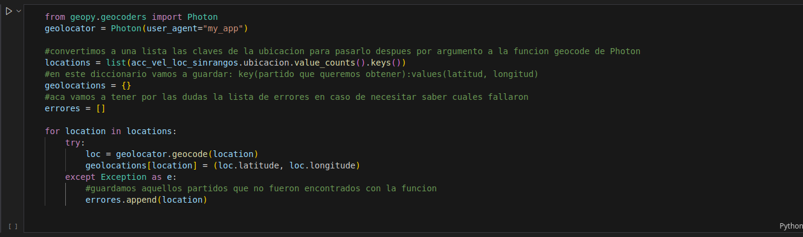
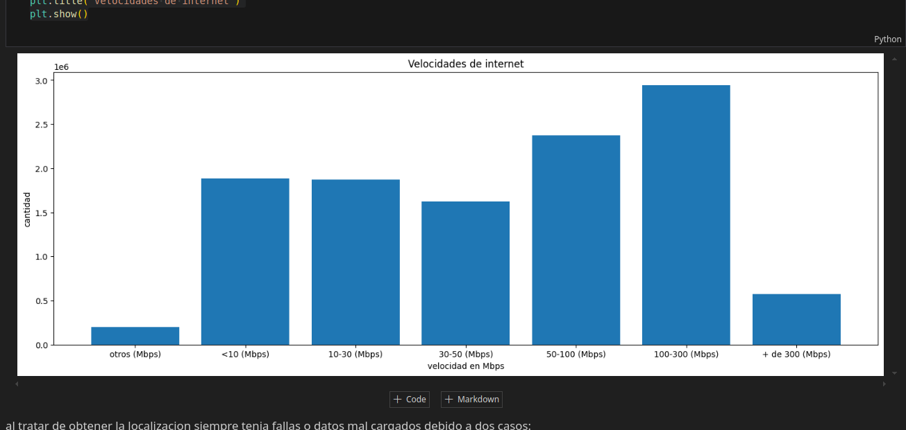
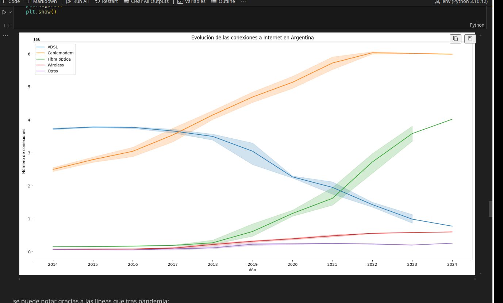
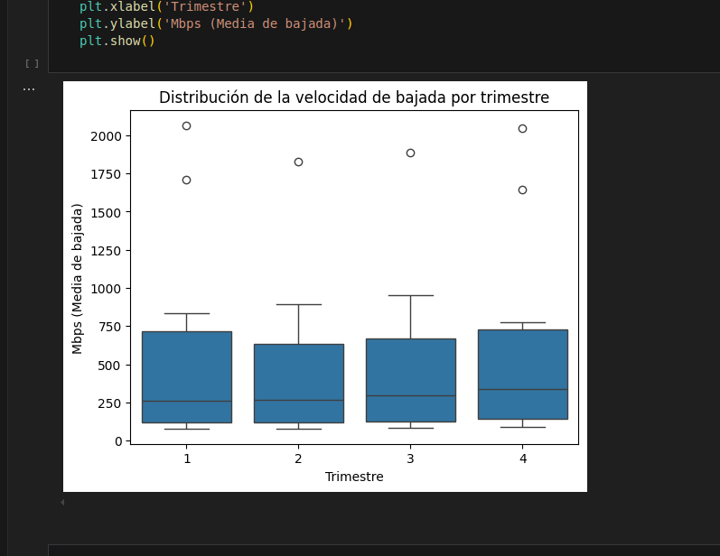
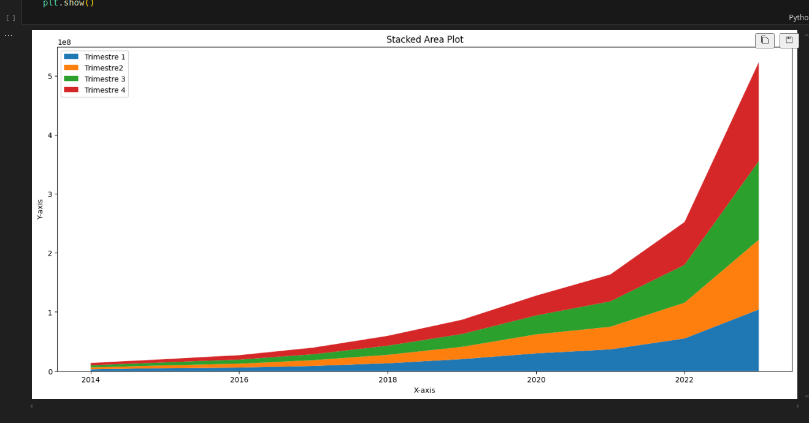

# - [Acceder al grafico: Tableau Public PIDA-Internet](https://public.tableau.com/app/profile/matias.barrios7113/viz/piData-Analytics_internet/Historia1)  
# - Fuentes de información  

Los datos utilizados en este análisis fueron proporcionados por el Ente Nacional de Comunicación de la República Argentina. Esta institución es responsable de recopilar y proporcionar información sobre la conectividad y el acceso a Internet en todo el país.  

# - Datos crudos  

El archivo de datos utilizado para este análisis se llama "internet.xlsx" y contiene 15 hojas de cálculo diferentes. Cada hoja proporciona información sobre un aspecto específico de la conectividad a Internet en la Argentina, como la tecnología utilizada, la velocidad de conexión, la penetración en hogares y población, entre otros.  

A continuación, se presentan las 15 hojas de cálculo que componen el archivo de datos:

- Accesos por tecnología   
- Accesos por velocidad   
- Accesos tecnología por localidad   
- Acc_vel_loc_sinrangos   
- Dial-BAf   
- Ingresos   
- Penetración_hogares   
- Penetración_población   
- Penetración_totales   
- Totales_accesos_por_tecnología   
- Totales_accesos_por_velocidad   
- Totales_Dial-BAf   
- Totales_VMD   
- Velocidad_%_por_prov   
- Velocidad_por_prov   
- Velocidad_sin_rangos   
- Proceso de ETL   

Para preparar los datos para el análisis, se realizó un proceso de ETL (Extracción, Transformación y Carga) en cada una de las 15 hojas de cálculo. En la mayoría de los casos, el proceso de ETL consistió en:   

Verificar la existencia de valores repetidos en cada hoja de cálculo   
Contar la cantidad de filas para asegurarse de que no hubiera datos nulos   
Sin embargo, en 3 de las hojas de cálculo, se realizaron procedimientos adicionales para asegurarse de que los datos estuvieran en el formato correcto para el análisis.   

# - Almacenamiento de datos  

Una vez que los datos fueron procesados y verificados, se almacenaron en formato Parquet para facilitar su análisis y visualización. Solo 6 de las 15 hojas de cálculo fueron seleccionadas para el análisis, ya que se consideraron las más relevantes para el estudio.

Además, se utilizó la biblioteca Geopy para obtener información geográfica sobre los partidos de la Argentina, lo que permitió ubicar los datos en un mapa sin necesidad de rellenar filas con cada localidad distinta del país.

# - Análisis Exploratorio de Datos (EDA)

Antes de proceder a la visualización de los datos, se realizó un análisis exploratorio de estos mismos (EDA) para asegurarse de que los datos estuvieran en el formato correcto y para identificar patrones y tendencias que nos podrian ayudar en los dashboard. El objetivo del EDA es obtener una comprensión profunda de los datos y descubrir características y relaciones que no sean inmediatamente evidentes.

*Técnicas de visualización de datos*

En el EDA, se utilizaron varias técnicas de visualización de datos para explorar los datos y obtener conclusiones sobre la conectividad a Internet en la Argentina. A continuación, se presentan las técnicas de visualización de datos que se utilizaron:

Gráficos de barras: se utilizaron para visualizar la distribución de los datos y comparar las frecuencias de diferentes categorías. Por ejemplo, se utilizó un gráfico de barras para visualizar la distribución de los accesos a Internet por tecnología.  
    
 
Líneas cruzadas: se utilizaron para visualizar la tendencia de los datos a lo largo del tiempo. Por ejemplo, se utilizó una línea de tendencia para visualizar la evolución de los medios de accesos a Internet (tecnologia) en la Argentina durante los últimos años.  
    
 
Cajas y bigotes: se utilizaron para visualizar la distribución de los datos y comparar las medias y las desviaciones estándar de diferentes grupos. Por ejemplo, se utilizó un gráfico de cajas y bigotes para visualizar la distribución de la velocidad de bajada por trimestre
    
 
Gráficos de dispersión: se utilizaron para visualizar la relación entre dos variables. Por ejemplo, se utilizó un gráfico de dispersión para visualizar la relación entre la velocidad media durante el paso de los años, ademas que para visualizar la separacion y mejora de la velocidad por trimestre
    
 
Grafico de sombras: por ultimo se visualizo el ingreso por año, sin embargo la inflacion en Argentina sesga demasiado el valor por lo que decidi no analizarlo, por otro lado podria haber comparado el tipo de cambio por trimestre pero tampoco nos habria dado un valor real de ganancia trimestral, ya que en ocasiones la subida del dolar se daba en semanas y tenia picos de subida y bajada, por otro lado las empresas tenian un tope para subir los precios de los servicios para que ajusten su valor. Por lo que tendria que haber sobrecargado de variables a la medicion.
  
 
Resultados del EDA  

Los resultados del EDA proporcionaron una visión general de la situación de la conectividad a Internet en la Argentina. A continuación, se presentan algunos de los resultados más destacados:

La mayoría de los accesos a Internet en la Argentina se realizan a través de tecnologías de Cablemodem.  
La velocidad de conexión a Internet varía significativamente según la provincia y la localidad.  
La penetración de Internet en los hogares es mayor en las provincias más desarrolladas económicamente.  

Información para la creación del dashboard  
En el siguiente link dejo acceso a la pagina de Tableau donde publico el grafico:  
# - [Acceder al grafico: Tableau Public PIDA-Internet](https://public.tableau.com/app/profile/matias.barrios7113/viz/piData-Analytics_internet/Historia1)  

Los resultados del EDA se utilizaron para informar la creación del dashboard y para proporcionar una visión general de la situación de la conectividad a Internet en el país.  
El dashboard se diseñó para visualizar los datos de manera clara y concisa, y para permitir a los usuarios explorar los datos de manera interactiva.
